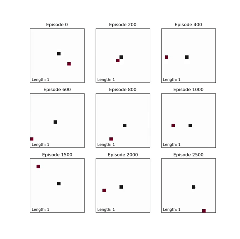

# Snake-Reinforcement-Learning
Applying basic reinforcement learning principles using the Snake game in Python

Snake.py is a basic snake game.

QLearning.py teaches an agent to play the snake game using Q-Learning. For every move, the game will send a reward. If the snake collides with itself or a wall, there is a negative reward. If the snake moves towards the food, there is a positive reward.

The Q matrix is initially filled with zeros. The size is (number of states, number of actions).

Every move that the agent makes, the Q table is updated as below:

Q[state, action] = reward + gamma * max(Q[new_state, :])

During the training phase, the agent will either choose the action with the max Q value at that state or the agent will randomly choose an action. The Q matrix is then updated using the equation above.

This process is repeated until the game is complete. Many games are played to update the Q matrix.

QLearning.py will automatically animate some samples games at various stages of the training process.

See below for example games using the Q matrix at various stages in the training process.

